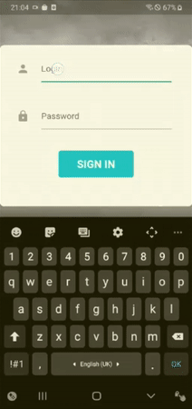
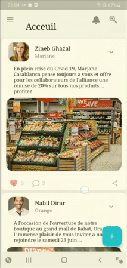
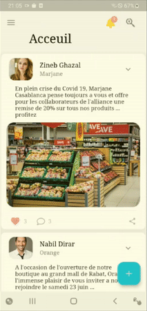
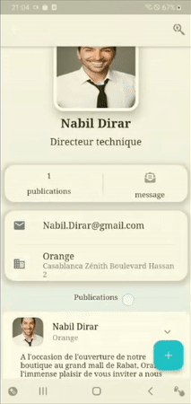
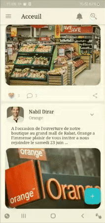
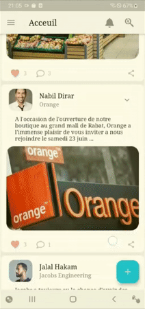

# My-App
- Used technologies:
  * flutter
  * NodeJs Express
  * Mongodb
  * flutter map by leaflet api
  * Socket I.O library
## Some Features 

|  |                          |
|                Authentification                  |                          Feed                    |
|                  |  |
|                   Comments                       |      Notifications & Approval of publications    |
|    |                |
|             Chat & messaging                     |                   Searching                      |
|    |
|                   publish                        |

## Running the app:
- Install Node.js, Flutter and then add them to your environnement variables (see flutter & node.js documentation)
- Clone the repo on your machine with the command `git clone https://github.com/moroChev/DigiShare.git`
##### Backend side
1. Go to the folder `./codeSource/backend` 
2. Install all dependencies with `npm install`
3. Run the server with `npm start`
##### Mobile Side
1. Go to the folder `./codeSource/frontend/MyApp` 
2. Check device existence with `flutter devices` and make sure there is one connected 
3. Run the application with `flutter run`

### Developed by:
- Mohamed Ech-charay
- Mohcine Rouessi
